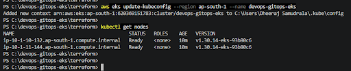
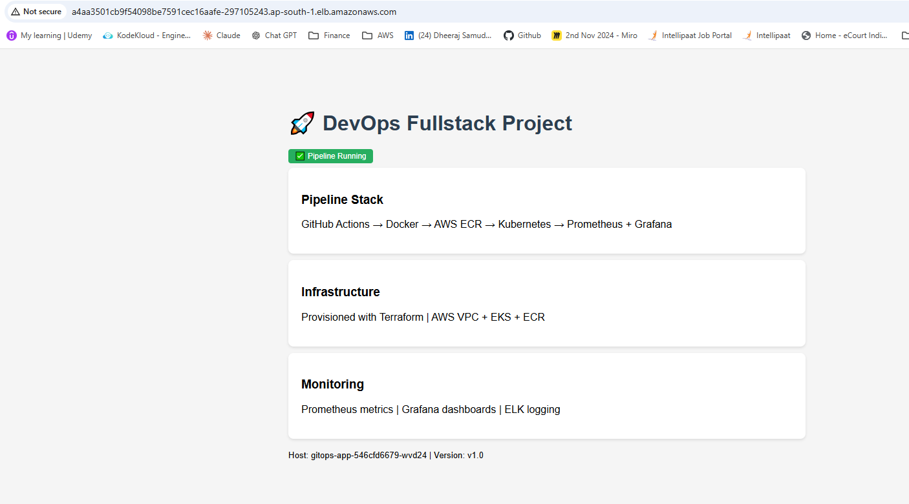
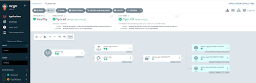
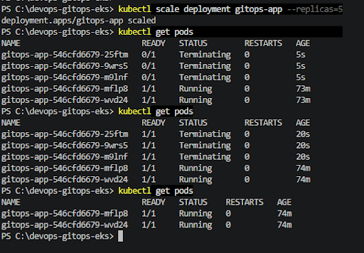

# GitOps with ArgoCD on AWS EKS

Hands-on GitOps implementation using Terraform to provision AWS EKS infrastructure and ArgoCD to continuously reconcile Kubernetes application state from Git.

> **Project status:** The EKS environment was created and tested as a hands-on implementation and is currently torn down to avoid ongoing AWS charges. The infrastructure can be recreated using the Terraform configuration in this repository.

## Architecture

```text
Git Repository
(k8s/ = desired state)
        |
        v
     ArgoCD
  (GitOps sync)
        |
        v
   AWS EKS Cluster
        |
        v
 Kubernetes Deployment
        |
        v
 AWS Load Balancer
```

## Tech Stack

| Technology | Purpose |
|---|---|
| Terraform | Infrastructure as Code |
| AWS EKS | Managed Kubernetes cluster |
| AWS VPC | Network infrastructure |
| AWS Load Balancer | Public access to the application |
| ArgoCD | GitOps continuous delivery and reconciliation |
| Kubernetes | Application deployment and service management |
| kubectl | Cluster interaction and verification |

## Repository Structure

```text
devops-gitops-eks/
├── terraform/
│   ├── main.tf
│   ├── variables.tf
│   ├── outputs.tf
│   └── .gitignore
├── k8s/
│   ├── deployment.yaml
│   └── service.yaml
├── argocd-synced.png
├── eks-nodes.png
├── loadbalancer.png
├── self-healing.png
└── README.md
```

## Infrastructure Provisioned with Terraform

The project provisions:

- VPC with 2 public and 2 private subnets across 2 Availability Zones
- Internet Gateway
- NAT Gateway for private subnet internet access
- AWS EKS cluster using Kubernetes v1.30
- Managed node group with 2 `t3.medium` worker nodes
- IAM roles for the EKS cluster and worker nodes
- AWS networking and supporting resources

The Terraform configuration created 22 AWS-managed resources during the hands-on implementation and can recreate the environment with `terraform apply`.

## Kubernetes Deployment

The Kubernetes configuration includes:

- 2 application replicas
- RollingUpdate deployment strategy
- `maxSurge: 1`
- `maxUnavailable: 0`
- Liveness and readiness probes using the `/health` endpoint
- `LoadBalancer` service for AWS load balancer integration

The deployment configuration is retained in Git so the application state can be recreated when the EKS environment is running.

## GitOps with ArgoCD

The ArgoCD application was configured with:

- Automatic synchronization
- Self-healing
- Resource pruning

Git acts as the desired-state source. Instead of manually applying every Kubernetes change, ArgoCD continuously reconciles the cluster with the manifests stored in the repository.

### Self-Healing Demonstration

The deployment was initially defined with 2 replicas.

A manual change was then made:

```bash
kubectl scale deployment gitops-app --replicas=5
```

ArgoCD detected the difference between the live cluster and the Git-defined state and reconciled the deployment back to 2 replicas without manually changing it back with `kubectl`.

This demonstrated the core GitOps self-healing behavior.

## Screenshots

### EKS Worker Nodes

Two `t3.medium` worker nodes provisioned through Terraform and registered with the EKS cluster.



### AWS Load Balancer

The Kubernetes `LoadBalancer` service triggered AWS load balancer provisioning and exposed the application through an AWS endpoint.



### ArgoCD Synced Application

ArgoCD showing the application as healthy and synchronized with the Kubernetes manifests stored in Git.



### GitOps Self-Healing

Terminal output demonstrating the replica count being changed manually and then reconciled by ArgoCD.



> These screenshots were captured during the hands-on EKS implementation. The AWS environment is not kept running continuously.

## How to Reproduce

### 1. Provision the infrastructure

```bash
cd terraform
terraform init
terraform apply
```

### 2. Configure kubectl for EKS

```bash
aws eks update-kubeconfig   --region ap-south-1   --name devops-gitops-eks
```

### 3. Install ArgoCD

```bash
kubectl create namespace argocd

kubectl apply -n argocd   -f https://raw.githubusercontent.com/argoproj/argo-cd/stable/manifests/install.yaml   --server-side
```

### 4. Get the ArgoCD admin password

```bash
kubectl -n argocd get secret argocd-initial-admin-secret   -o jsonpath="{.data.password}" | base64 -d
```

### 5. Access the ArgoCD UI

```bash
kubectl port-forward svc/argocd-server -n argocd 8080:443
```

Open:

```text
https://localhost:8080
```

### 6. Create the ArgoCD Application

Create an ArgoCD Application pointing to this repository and the `k8s/` directory.

Configure automated synchronization, self-healing, and pruning.

### 7. Verify GitOps behavior

```bash
kubectl get pods
kubectl get deployment
kubectl get service
```

Then test self-healing:

```bash
kubectl scale deployment gitops-app --replicas=5
```

Observe ArgoCD reconcile the deployment back to the Git-defined replica count.

## Cleanup

AWS resources should be destroyed after the hands-on session to avoid ongoing charges.

First remove the ArgoCD installation:

```bash
kubectl delete -n argocd   -f https://raw.githubusercontent.com/argoproj/argo-cd/stable/manifests/install.yaml

kubectl delete namespace argocd
```

Then destroy the Terraform-managed infrastructure:

```bash
cd terraform
terraform destroy
```

Verify the EKS cluster has been removed:

```bash
aws eks list-clusters --region ap-south-1
```

## Key Learnings

- Provisioning AWS infrastructure with Terraform
- Working with managed Kubernetes using AWS EKS
- Kubernetes deployments, services, and health probes
- AWS Load Balancer integration with Kubernetes
- GitOps principles using ArgoCD
- Automatic synchronization and self-healing
- Using Git as the desired state for Kubernetes
- Separating infrastructure provisioning from application deployment
- Keeping Terraform state files out of source control

For a team environment, remote Terraform state and state locking would be a natural next improvement.

## Author

**Dheeraj Samudrala**

DevOps / Cloud Engineering

- GitHub: https://github.com/DheerajSam
- LinkedIn: https://www.linkedin.com/in/dheeraj-cloud/
